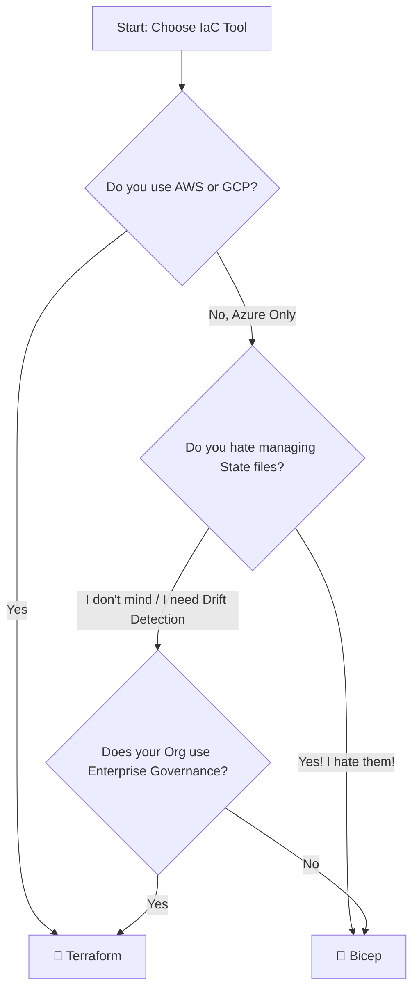

# ⚔️ Terraform vs. Bicep: The IaC Showdown

**Last Updated:** Jan 2026 | **Tools Tested:** Terraform v1.10+, Bicep v0.33+

---

## ⚡ TL;DR (30-second version)

*   ☁️ **Multi-Cloud Architect?** → 💜 **Terraform** (One tool for AWS, Azure, GCP)
*   🔷 **Azure-Only Shop?** → 💪 **Bicep** (Native integration, simpler syntax, no state file)
*   🏢 **Enterprise Corp?** → 💜 **Terraform** (Mature governance, Sentinel policies)
*   🚀 **Azure Startup?** → 💪 **Bicep** (Fastest setup, zero friction)

---

## 🧭 Legend & Scoring System

| Icon | Rating | Meaning |
| :---: | :--- | :--- |
| 🟩 | **Winner** | Best in class, easiest to use, or most powerful. |
| 🟨 | **Neutral** | Good, workable, but has caveats. |
| 🟥 | **Loser** | Expensive, complex, or limited. |

*   💜 = **Terraform** (HashiCorp/IBM)
*   💪 = **Bicep** (Microsoft)

---

## 🧩 The Master Comparison Table

| Product Identity | Cloud Support | State Management | Syntax & DX | Learning Curve | Day-0 Support | Verdict |
| :--- | :---: | :---: | :---: | :---: | :---: | :--- |
| 💜 **Terraform** Open Source (ish) Cross-Platform | 🟩 **Universal** (AWS, Azure, GCP, K8s) | 🟨 **Complex** (Requires remote backend) | 🟨 **HCL** (Declarative, verbose) | 🟨 **Medium** (Concepts like State/Plan) | 🟨 **Lagged** (Relies on provider updates) | **The Swiss Army Knife.** Best for multi-cloud & complex governance. |
| 💪 **Bicep** Open Source Azure Native | 🟥 **Azure Only** (No AWS/GCP support) | 🟩 **Stateless** (Managed by Azure ARM) | 🟩 **Clean DSL** (Concise, type-safe) | 🟩 **Easy** (Abstracts ARM JSON pain) | 🟩 **Instant** (Native API parity) | **The Azure Expert.** Unbeatable if you *never* leave Azure. |

---

## 🧠 Deep Dive

### 💜 Terraform
The undisputed king of Infrastructure as Code. Terraform uses a state file (`terraform.tfstate`) to map your code to real-world resources, allowing it to destroy, update, and track infrastructure with precision. It allows you to learn *one* language (HCL) and deploy to *any* cloud. However, managing the state file is a notorious headache (locking, corruption, secrets), and the recent licensing changes (BUSL) have stirred the community.

### 💪 Bicep
Microsoft's apology for ARM Templates. Bicep is a transparent abstraction over ARM API, meaning it compiles down to standard ARM JSON but offers a much friendlier developer experience. It is **stateless**, meaning it queries Azure directly to understand the current state. This eliminates "state drift" issues but can make "previewing" changes (what-if) less reliable than Terraform's `apply`. It has immediate support for every new Azure feature the moment it releases.

---

## 🏆 Recommendations by Persona

### ☁️ The Multi-Cloud Architect
**Goal:** Unified workflow across AWS, Azure, and GCP.
*   🥇 **Top Choice:** 💜 **Terraform**. You cannot afford to maintain three different languages (Bicep, CloudFormation, Deployment Manager).
*   ❌ **Avoid:** 💪 **Bicep**. It simply does not work outside Azure.

### 🔷 The Azure Purist
**Goal:** Deep integration, minimal friction, 100% Azure.
*   🥇 **Top Choice:** 💪 **Bicep**. Why install a 3rd party binary and manage state storage accounts when Bicep is built into the Azure CLI?
*   🥈 **Alternative:** 💜 **Terraform**. Use it only if you foresee a future migration.

### 🏢 The Enterprise Corp
**Goal:** Compliance, Policy as Code, Drift Detection.
*   🥇 **Top Choice:** 💜 **Terraform**. The ecosystem (Terraform Cloud, Sentinel, OPA) is far more mature for enforcing strict governance at scale.
*   🥈 **Alternative:** 💪 **Bicep**. Requires Azure Policy for governance, which is powerful but different from the IaC workflow.

### 🚀 The Startup Speedster (Azure)
**Goal:** Ship features yesterday. No DevOps team.
*   🥇 **Top Choice:** 💪 **Bicep**. `az bicep build` and go. No init, no state locking, no backend config.
*   ❌ **Avoid:** 💜 **Terraform**. Too much boilerplate for a team of 2 devs.

---

## 🗺️ Decision Tree

---

## ❓ FAQ & Myths

### "Is Bicep just a wrapper for ARM?"
**Yes, but that's a good thing.** It means there is no "Bicep engine" to upgrade or break. It translates your code 1:1 into API calls that Azure understands natively.

### "Terraform enables Multi-Cloud Portability, right?"
**❌ MYTH.** A Terraform script written for AWS **will not** work on Azure. You definitely reuse the *skillset* (HCL, logic, workflow), but you have to rewrite the *code* (resources) entirely.

### "Can I mix them?"
**Technically yes, but don't.** using Terraform to deploy the network and Bicep to deploy the apps is a recipe for disaster where neither tool knows the full picture. Pick one and commit.
